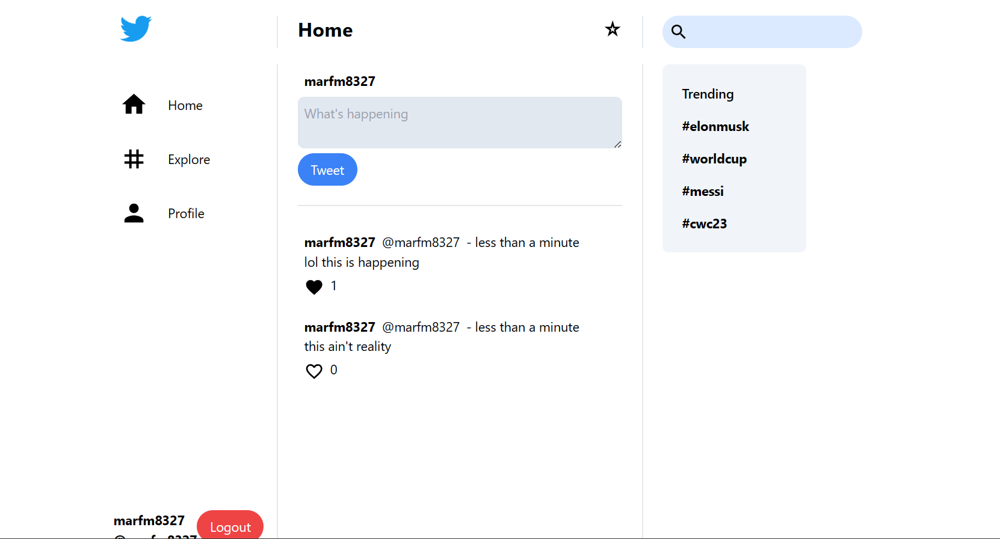

## Full stack twitter clone using React, Node, Express, MongoDB, Firebase Storage, and JWT

A simple clone of twitter (known as X).

### Installation
Currently, the service is not deployed and the ENV and firebase credentials are exposed. So, to run the app
one needs to clone it, npm install in both **server** and **client** directories and run both backend and
frontend services using *npm install*